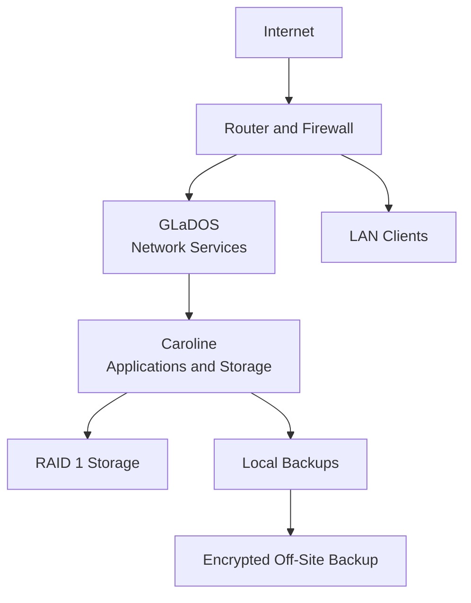
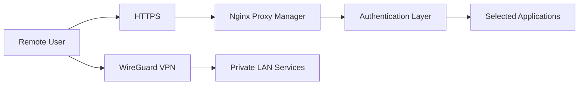
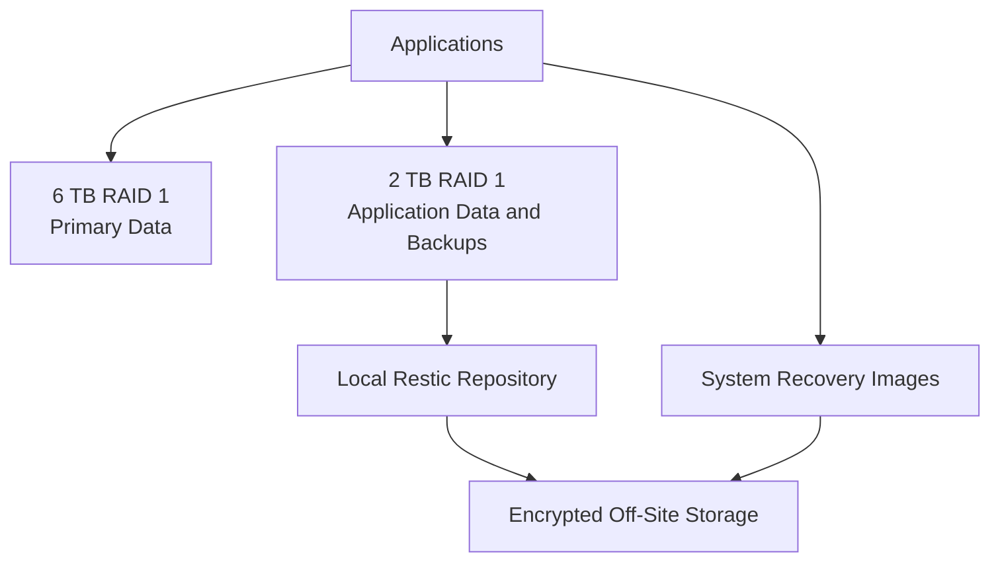
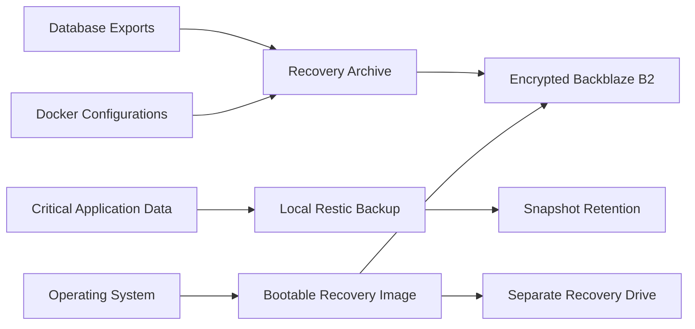

# Steve's Homelab

> A self-hosted, multi-server Linux environment built for private cloud services, media, networking, identity management, monitoring, and disaster recovery.

## Overview

I designed and maintain this homelab to gain practical experience with Linux administration, networking, storage, containerization, security, monitoring, and backup engineering. It started as a way to run a few services locally and has grown into a two-server environment with separated application and network responsibilities.

The environment is built around two Lenovo Tiny PCs:

- **Caroline** is the primary application and storage server.
- **GLaDOS** provides network infrastructure, secure remote access, DNS, reverse proxying, and monitoring.

Most applications run as Docker containers managed with Docker Compose. Persistent application data is kept outside the containers so services can be upgraded, recreated, and restored without losing their configuration or databases.

My priorities for the project are:

- Reliability and straightforward recovery
- Limited public exposure
- Secure remote access
- Separation of application and network workloads
- Redundant storage for important data
- Automated local and encrypted off-site backups
- Clear documentation and repeatable maintenance

## High-Level Architecture

Public requests are accepted only for selected services. Traffic passes through the router to the reverse proxy on GLaDOS, where TLS is terminated and requests are forwarded to the correct internal application. Administrative interfaces remain local or are accessed through the VPN.

## Hardware

| System | Hardware | Primary role |
| --- | --- | --- |
| Caroline | Lenovo M73 Tiny, Intel Core i5, 12 GB RAM, 250 GB SSD | Docker applications, databases, media, storage, and backups |
| GLaDOS | Lenovo M72 Tiny, Intel Core i3, 8 GB RAM | DNS, VPN, reverse proxy, monitoring, and network utilities |
| Storage enclosure | TerraMaster multi-bay direct-attached storage | Houses the hard drives used by the Linux RAID arrays |
| Primary storage | Two 6 TB WD Red Pro drives in RAID 1 | Main application data, photos, and media |
| Secondary storage | Two 2 TB drives in RAID 1 | Application data, backups, books, and related files |
| Recovery storage | Separate 2 TB hard drive | Full-system recovery images and recovery archives |
| Router | ASUS RT-AX58U running Asuswrt-Merlin | Routing, firewall, DHCP reservations, DNS enforcement, and port forwarding |
| Power protection | APC Back-UPS with USB monitoring | Power-loss protection and UPS status monitoring |
| Console access | Dedicated KVM devices | Local-style console access without relying on normal remote shell administration |

The RAID arrays provide drive redundancy, but I do not treat RAID as a backup. Separate local and off-site backup systems protect the data from accidental deletion, corruption, system failure, and loss of the primary storage enclosure.

## Server Responsibilities

### Caroline — Applications and Storage

Caroline handles most stateful workloads and data-heavy services. Its responsibilities include:

- Hosting Docker applications and supporting databases
- Providing private cloud storage and photo management
- Running media, music, ebook, and audiobook services
- Hosting password management and identity services
- Managing RAID-backed application and media storage
- Creating database exports and configuration archives
- Running scheduled local and off-site backup jobs
- Producing full-system recovery images
- Monitoring storage health and available capacity

### GLaDOS — Network Infrastructure

GLaDOS separates network-facing utilities from the main application server. Its responsibilities include:

- Network-wide DNS filtering
- Upstream DNS resolution
- Reverse proxy routing
- TLS termination for selected public services
- WireGuard VPN access
- Network and service monitoring
- Container log viewing and management tools
- Device discovery and new-device monitoring

This separation means the application server does not need to directly handle every connection arriving from the internet. It also allows network services to remain available while application workloads are being maintained.

## Network Design

### DNS

Pi-hole provides network-wide DNS filtering. The router is configured to direct local clients to the internal DNS service, reducing the chance that devices bypass the filtering configuration.

Unbound provides the upstream DNS layer. This design gives me control over local filtering and resolution behavior while keeping DNS services separate from individual applications.

The DNS environment includes:

- Network-wide filtering through Pi-hole
- Separate filtering policies for different device groups
- Local DNS records for internal services
- Router-level DNS enforcement
- Query and block-rate monitoring
- Troubleshooting with tools such as `dig`, `nslookup`, logs, and client cache clearing

### Reverse Proxy and TLS

Nginx Proxy Manager runs on GLaDOS and routes requests to services hosted on the internal network. I manage a custom domain and configure the required DNS records and TLS certificates.

The reverse proxy design allows multiple services to share standard HTTPS ports while routing requests according to hostname. Only specifically selected services are published; dashboards, databases, and most administrative interfaces stay private.

Tasks I perform in this area include:

- Creating and updating proxy hosts
- Mapping public hostnames to internal services
- Installing and renewing TLS certificates
- Troubleshooting certificate-chain and hostname issues
- Testing internal and external name resolution
- Diagnosing NAT loopback and upstream gateway problems
- Reviewing proxy access and error logs
- Restricting access to administrative interfaces

### Remote Access

WireGuard provides encrypted remote access to the private network. This lets approved devices reach internal resources without publicly exposing every application.

I manage:

- VPN peer creation and removal
- Allowed network routes
- UDP port forwarding
- Client configuration
- Internal DNS access over the tunnel
- Connectivity troubleshooting between remote clients and LAN services

### Router and Firewall Administration

The router runs Asuswrt-Merlin and handles:

- DHCP and static reservations
- Firewall policies
- Controlled port forwarding
- DNS enforcement
- NAT and local loopback behavior
- WAN configuration
- VPN and internal route considerations

I keep the number of forwarded ports limited and use the reverse proxy or VPN instead of creating a separate public port for every application.

## Container Platform

Most services are deployed with Docker Compose. I keep related containers together in logical stacks and use bind mounts or named volumes for persistent data.

My Docker administration work includes:

- Writing and updating Compose YAML files
- Managing image versions and controlled upgrades
- Configuring networks, ports, volumes, and environment variables
- Connecting applications to MariaDB or PostgreSQL databases
- Reviewing container health checks and restart behavior
- Reading application and database logs
- Recreating individual containers without disturbing an entire stack
- Diagnosing dependency, permission, path, and configuration problems
- Validating Compose configuration before deployment
- Confirming service health after storage, host, or network maintenance

I avoid treating containers as permanent machines. Application state is stored in persistent locations, allowing a failed or outdated container to be replaced while preserving the data it needs.

## Services

The following list represents the main types of services I operate. The portfolio focuses on the infrastructure and administration involved rather than the entertainment value of individual applications.

### Private Cloud and Collaboration

| Service | Purpose | Experience demonstrated |
| --- | --- | --- |
| Nextcloud | Private file sync, contacts, and calendars | Web application administration, database integration, storage, CalDAV/CardDAV, backups |
| Collabora Online | Browser-based document editing | Reverse proxying, TLS, application integration, domain configuration |
| Immich | Private photo and video management | PostgreSQL, machine-learning container, large media libraries, backup planning |

### Identity and Security

| Service | Purpose | Experience demonstrated |
| --- | --- | --- |
| Authentik | Central authentication and single sign-on | Identity providers, application integration, access policies, PostgreSQL |
| Vaultwarden | Self-hosted password management | Security-sensitive deployment, persistence, encrypted backups, controlled access |
| Fail2ban | Automated response to repeated authentication failures | Log monitoring, filters, jails, proxy integration |

### Media and Library Services

| Service group | Purpose | Experience demonstrated |
| --- | --- | --- |
| Jellyfin | Media streaming | Storage mapping, transcoding, user access, reverse proxying, customization |
| Sonarr, Radarr, Lidarr, Prowlarr and related tools | Media organization and automation | API integration, permissions, paths, hardlinks, container networking |
| Navidrome | Music streaming | Library management and persistent configuration |
| Kavita and Audiobookshelf | Ebook and audiobook libraries | Storage organization, user management, metadata, service integration |
| Jellyseerr | Media request management | API connections, user authentication, application integration |

### Monitoring and Administration

| Service | Purpose |
| --- | --- |
| Uptime Kuma | Availability monitoring and service checks |
| Homarr | Central service dashboard |
| Dozzle | Container log viewing |
| Dockhand / Portainer | Container visibility and controlled management |
| NetAlertX / WatchYourLAN | Network device discovery and presence monitoring |
| Cronicle | Scheduled-job visibility and reporting |

## Identity and Access Management

Authentik provides centralized authentication for supported services. I have configured application providers, login flows, users, and access controls, then connected those providers to applications through supported authentication methods or proxy-based access.

My approach is to use multiple layers rather than relying on a single login page:

- Application authentication where available
- Centralized authentication for supported services
- Multi-factor authentication for sensitive accounts
- TLS for data in transit
- VPN-only access for private administrative tools
- Fail2ban monitoring for repeated failed requests
- Minimal direct exposure of internal ports

## Storage Architecture

The storage system uses Linux software RAID 1 to mirror data across pairs of disks. I monitor array state through `/proc/mdstat`, check mismatch counts after consistency operations, and review kernel and SMART information when diagnosing possible drive or enclosure problems.

Storage administration tasks include:

- Creating and mounting RAID 1 arrays
- Verifying both members are active and synchronized
- Running consistency checks and reviewing mismatch counts
- Monitoring drive health with SMART data
- Reviewing kernel logs for resets, timeouts, and I/O errors
- Maintaining stable mount points for Docker volumes
- Confirming containers recover correctly after storage maintenance
- Investigating USB enclosure behavior and power-management issues
- Planning capacity and separating replaceable media from critical data

## Backup and Disaster Recovery

Backup and recoverability are major priorities in this project. I use multiple backup methods because no single tool protects against every failure scenario.

### Local Backups

Restic creates scheduled local snapshots of important data. Backup jobs check that required storage is mounted before starting, reducing the risk of accidentally writing backup data into an empty mount directory on the operating-system disk.

Local backups provide:

- Fast recovery of recently changed or deleted files
- Snapshot history
- Deduplication
- Integrity checking
- Recovery without depending on internet access

### Off-Site Backups

rclone transfers selected recovery data to Backblaze B2. Sensitive backup sets are encrypted before or during transfer. Retention rules remove expired recovery sets so cloud usage remains controlled.

The off-site set includes critical information such as:

- Application configuration
- Docker Compose files
- Selected application data
- Database exports
- Password-management data
- Authentication database exports
- Recovery archives
- Full-system recovery sets

Large, replaceable media files are generally excluded. This is a deliberate cost and recovery decision: application configuration, request history, databases, and automation records are more important because they help reconstruct the environment and reacquire replaceable content.

### Application-Consistent Backups

Databases require more than simply copying their live files. Scheduled scripts create database exports for services using MariaDB and PostgreSQL. For particularly sensitive services, the relevant application is briefly handled in a way that produces a consistent backup before normal operation resumes.

### Full-System Recovery

Relax-and-Recover creates bootable recovery images for the main server. These images are stored on a separate physical drive and copied to encrypted off-site storage according to the retention policy.

My recovery documentation covers:

- Booting from recovery media
- Restoring the operating system
- Reassembling and mounting storage
- Restoring Docker configuration and application data
- Importing database exports
- Starting services in the correct order
- Validating DNS, proxy, authentication, and application health

## Monitoring and Maintenance

The environment is actively maintained rather than installed once and ignored. Routine work includes:

- Reviewing container status and health checks
- Checking service availability
- Monitoring storage capacity and RAID state
- Reviewing SMART attributes and kernel logs
- Installing application and container updates
- Validating service health after updates
- Reviewing backup reports and retention results
- Testing DNS and external HTTPS access
- Checking certificate validity
- Investigating newly detected network devices
- Documenting configuration and recovery changes

Updates are approached carefully because simultaneous upgrades can make failures harder to isolate. For important services, I review release information, confirm backups, update in a controlled order, and verify the application afterward.

## Troubleshooting Experience

Maintaining the homelab has required troubleshooting across the full path between a user and an application. Examples include:

### Networking and DNS

- Diagnosed name-resolution failures caused by client caching and DNS enforcement
- Resolved NAT loopback and upstream gateway configuration problems
- Traced requests through DNS, router forwarding, reverse proxy, and application layers
- Verified routes and allowed networks for VPN clients
- Investigated ports that were unavailable because of conflicts or incorrect mappings

### Containers and Applications

- Diagnosed unhealthy containers using status output, health checks, and logs
- Corrected incorrect volume paths, permissions, environment variables, and service dependencies
- Recovered services after storage migrations and host restarts
- Investigated HTTP 500, 502, and 503 errors by testing each layer independently
- Used application APIs and database tools when graphical interfaces were insufficient

### Storage

- Verified RAID arrays after moving drives between enclosures
- Investigated USB resets and disk communication issues through kernel logs
- Used SMART data to distinguish disk-health problems from enclosure or connection problems
- Verified filesystem mounts before starting containers or backups
- Confirmed hardlinks and media paths when diagnosing import problems

### Certificates and Authentication

- Diagnosed certificate issuance and renewal failures
- Verified certificate subject, issuer, expiration dates, and subject alternative names
- Troubleshot authentication flows between users, identity providers, proxies, and applications
- Reviewed access logs when developing Fail2ban filters and authentication protections

## Documentation

I maintain documentation because a system that only works while its creator remembers every detail is not maintainable. My documentation includes:

- Service locations and responsibilities
- Docker stack organization
- Storage mount points and array purpose
- Backup schedules and retention policies
- Recovery procedures
- Domain and proxy relationships
- Authentication integrations
- Common troubleshooting commands
- Post-maintenance validation steps

Sensitive values such as passwords, API keys, encryption secrets, public addresses, and recovery credentials are intentionally excluded from this public repository.

## Technical Skills Demonstrated

### Operating Systems and Administration

- Linux server administration
- Bash and command-line troubleshooting
- systemd services and timers
- Cron scheduling
- Filesystem permissions and ownership
- Log analysis

### Containers and Applications

- Docker Engine
- Docker Compose
- Container networking
- Persistent volumes and bind mounts
- Health checks and dependency troubleshooting
- Controlled image upgrades

### Networking

- TCP/IP fundamentals
- DNS and DHCP
- Routing and NAT
- Firewalls and port forwarding
- Reverse proxies
- TLS certificates
- WireGuard VPN
- Network troubleshooting

### Storage and Recovery

- Linux software RAID
- SMART monitoring
- Restic
- rclone
- Backblaze B2
- Database exports and restoration planning
- Full-system recovery images
- Retention and recovery documentation

### Databases and Identity

- MariaDB
- PostgreSQL
- SQLite-based application data
- Authentik
- Single sign-on concepts
- Multi-factor authentication

### Business and Communication

- Technical documentation
- Troubleshooting methodology
- Customer communication
- Record and metadata management
- Excel tracking
- Salesforce
- PC diagnostics and repair
- Hard-drive diagnostics and data recovery

## Design Decisions

### Why Two Servers?

Separating network utilities from application and storage workloads reduces the number of responsibilities assigned to one host. GLaDOS can continue providing DNS, VPN, and proxy services while Caroline is undergoing application or storage maintenance.

### Why Docker Compose?

Compose files document how services are configured and make deployments repeatable. Containers also isolate dependencies and allow individual services to be recreated or upgraded without rebuilding the entire server.

### Why RAID 1?

RAID 1 is simple, provides redundancy against a single-disk failure in each array, and matches the available hardware. It is supplemented by local and off-site backups because RAID cannot protect against deletion, corruption, theft, or a failed enclosure.

### Why Both Local and Off-Site Backups?

Local backups are faster to restore, while encrypted off-site backups protect against failures that affect the entire local environment. Full-system recovery images address operating-system loss, while application and database backups provide more granular restoration options.

### Why Keep Most Administration Private?

Publicly exposing an administrative dashboard adds risk without providing much benefit. The reverse proxy publishes only the services that need external access, while private tools are reached locally or through WireGuard.

## Future Improvements

Planned areas of continued development include:

- Moving storage into a purpose-built NAS chassis
- Improving physical disk cooling and cable management
- Expanding network segmentation for IoT and media devices
- Performing additional full recovery tests
- Improving infrastructure documentation and diagrams
- Adding more centralized logging and security visibility
- Continuing to automate health and backup reporting

## What I Learned

The most valuable part of this project has not been installing individual applications. It has been learning how the components depend on each other and how to troubleshoot failures systematically.

A web service may appear offline because of an application error, but it may also be caused by DNS, a certificate, the reverse proxy, a firewall rule, a missing storage mount, a database problem, a container network, or an upstream gateway. Maintaining this environment has taught me to verify each layer, use logs and direct tests instead of guessing, document the final solution, and consider how every change affects recovery.

---

This repository is a sanitized overview of the environment. It intentionally excludes credentials, secrets, complete configuration files, public addressing information, and other details that could weaken the security of the live systems.
